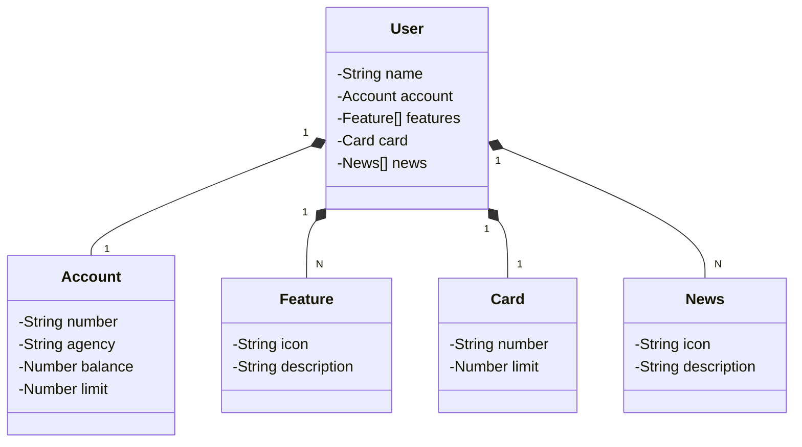

# API REST com Spring Boot e Java

Projeto desenvolvido como parte do desafio **"Publicando Sua API REST na Nuvem Usando Spring Boot 3, Java 17 e Railway"** da [DIO](https://www.dio.me/). O objetivo foi evoluir a API além do escopo das aulas (nível avançado), adicionando validações, tratamento estruturado de erros e novos endpoints.

## Tecnologias utilizadas

- **Java 17** — versão LTS utilizada para aproveitar os recursos mais recentes da linguagem.
- **Spring Boot 3** — base do projeto, com autoconfiguração e setup simplificado.
- **Spring Data JPA** — abstração da camada de persistência, integrada ao PostgreSQL em produção e H2 em desenvolvimento.
- **Bean Validation (jakarta.validation)** — validação declarativa dos dados de entrada nos endpoints.
- **OpenAPI / Swagger** — documentação automática da API, acessível via `/swagger-ui.html`.
- **Railway** — plataforma de deploy em nuvem com suporte a PostgreSQL como serviço.

## Evolução aplicada (nível avançado)

Esta versão vai além da replicação básica do projeto das aulas. As seguintes melhorias foram implementadas:

### Validações de entrada
Todos os DTOs receberam constraints do `jakarta.validation`. Campos obrigatórios são verificados antes de qualquer processamento, retornando um erro claro ao cliente em caso de dados inválidos.

### Tratamento estruturado de erros
O `GlobalExceptionHandler` foi expandido para capturar falhas de validação e devolver uma resposta JSON padronizada:

```json
{
  "status": 422,
  "message": "Validation failed.",
  "errors": [
    "name: must not be blank",
    "account.number: must not be blank"
  ]
}
```

### Novo endpoint de busca por nome
```
GET /users/search?name={termo}
```
Realiza uma busca parcial e insensível a maiúsculas/minúsculas pelo nome do usuário.

## Como executar localmente

**Pré-requisitos:** Java 17+ e Git.

```bash
git clone https://github.com/<seu-usuario>/<seu-repositorio>.git
cd <seu-repositorio>
./gradlew bootRun
```

A aplicação sobe com o perfil `dev` por padrão, usando banco de dados H2 em memória. O console do H2 fica disponível em `http://localhost:8080/h2-console`.

A documentação Swagger pode ser acessada em `http://localhost:8080/swagger-ui.html`.

## Deploy no Railway

O projeto está configurado para deploy automático no Railway. As variáveis de ambiente necessárias para o perfil de produção são:

| Variável | Descrição |
|---|---|
| `PGHOST` | Host do banco PostgreSQL |
| `PGPORT` | Porta do banco |
| `PGDATABASE` | Nome do banco |
| `PGUSER` | Usuário do banco |
| `PGPASSWORD` | Senha do banco |
| `SPRING_PROFILES_ACTIVE` | Deve ser `prd` |

Ao vincular um serviço PostgreSQL ao projeto no Railway, essas variáveis são injetadas automaticamente.

O comando de build configurado é `./gradlew build -x test` e o `Procfile` inicia a aplicação com o perfil correto:
```
web: java -Dspring.profiles.active=prd -jar build/libs/santander-dev-week-2023-api-0.0.1-SNAPSHOT.jar
```

## Diagrama de Classes (Domínio da API)



## Referências

- Repositório original do desafio: [github.com/falvojr/santander-dev-week-2023](https://github.com/falvojr/santander-dev-week-2023)
- Versão de referência avançada: [github.com/digitalinnovationone/santander-dev-week-2023-api](https://github.com/digitalinnovationone/santander-dev-week-2023-api)
- Design no Figma: [Santander — Projeto Web/Mobile](https://www.figma.com/file/0ZsjwjsYlYd3timxqMWlbj/SANTANDER---Projeto-Web%2FMobile?type=design&node-id=1421%3A432&mode=design&t=6dPQuerScEQH0zAn-1)
